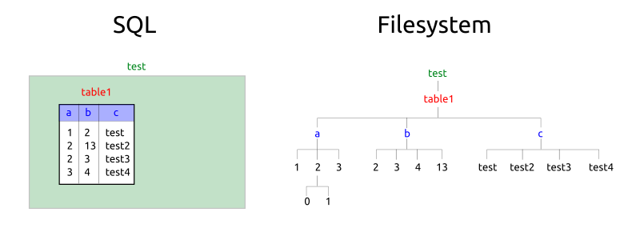

# SQL2FS - Mapping SQL as a File System

Mapping SQL (PostgreSQL, MariaDB, MySQL, SQLite) to a file system . . . because it's possible, and because how it should be done - bridging datasets to different views.



```
% sql2fs --backend=mysql my_database

% cd my_database/

% ls
table1/     table2/     table3/

% cd table1/

% ls
column1/    column2/    ...

% cd column1/

% ls
val1    val2    val3/   val4   val5    val6/ 

% more val1
{
   "column1": "val1",
   "column2": "some value",
   ...
}

% cd val3/

% ls
0   1   2   3 

% more 0
{
   "column1": "val3",
   "column2": "some other value",
   ...
}

% more 1
{
   "column1": "val3",
   "column2": "something else",
   ...
}
```

## Support
- Debian/Ubuntu 18.04/LTS
- PostgreSQL
- MariaDB
- MySQL
- SQLite

## Limitations
- highly experimental (unstable)
- barely any sanity checkings (insecure, easy to tamper and alter database/tables/etc)
- read only (see next "Todo")

## Todo
- content which clashes with UNIX filename notion:
  - large or long content: partially resolved in 0.0.5
  - ~~\r \n or general non-printable content (e.g. binary)~~: resolved in 0.0.5
- proper "write" support:
  - create new tables, e.g. `echo "a int, comment varchar" > new_table/.schema`
  - insert data into tables, e.g. `echo 'a=2 comment="testing something"' >> new_table/.tail`
  - remove data, e.g. `rm table/a/1` => deletes records `where a = 1`
  - etc
- deal with huge tables and query results (and long wait times):
  - progressivly update, timeout query after 1s, and provide directory list
    - display parts with extra file/dir "`more .../`" or so indicating it's not all yet
  - keep cache
  - provide additional fine-grained approach:
    - split up files into more directories, e.g. "Another File.txt" -> "An/Another File.txt"
  
## Download
```
% git clone https://github.com/Spiritdude/SQL2FS
% cd SQL2FS
```

## Install

On Debian/Ubuntu 18.04:
```
% sudo make requirements
% make install
```
Note: it just installs `sql2fs` to your local `~/bin/`.

## Use 
```
% psql test
test# select * from table1;
a | b  |   c
--+----+--------
1 |  2 | test
2 | 13 | test2
2 |  3 | test3
3 |  4 | test4
(4 rows)
# \q

% ./sql2fs test

% cd test/

% ls
table1/

% cd table1/

% ls
a/     b/     c/

% cd a/

% ls
1      2/     3
// Note: some are files and some are directories

% more 1
{
   "a": 1,
   "b": 2,
   "c": "test",
}

// Note: once you reached record level, you can access the column with adding '#column' to the filename:
% more 1#b
2

% more 1#c
test

// Note: some values might not be unique, therefore you can 'cd' into them, and see entries like 0 1 2 ...
% cd 2/

% ls 
0      1

% pwd
test/table1/a/2

% more 0
{ 
   "a": 2,
   "b": 13,
   "c": "test3"
}

% more 1
{ 
   "a": 2,
   "b": 3,
   "c": "test4"
}

% more 1#c
test4

```

## Exit & Unmount
```
% sudo umount test/
```

## Extended Use

Add in `/etc/fuse.conf`:
```
user_allow_other
```

so other users, like a web-server (lighttpd/apache/nginx) can access those mounted database/directories as well.

